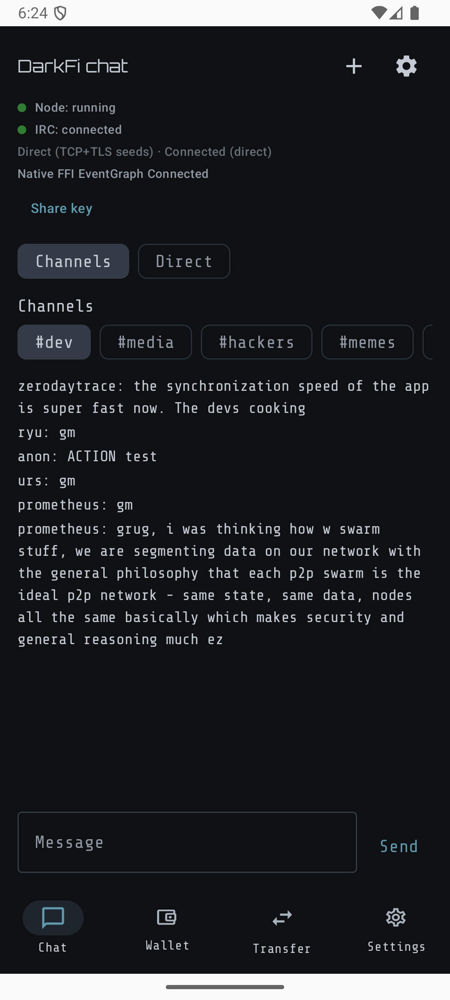

# Nighthawk Wallet (DarkFi Edition) — Android

<p align="center">
  
</p>

Privacy-preserving wallet (work-in-progress) by [Nighthawk Apps](https://nighthawkapps.com). This tree ships as a **new Android application id** on the DarkFi network (DRK). The app integrates a native DarkFi wallet API via **UniFFI** (`rust/darkfi-mobile-ffi` → generated Kotlin + `DarkfiMobileFfiApi`) for chain sync, broadcast, and chat.

**3.00.008** toolchain: Gradle **9.7.1**, Kotlin **2.2.10**, Compose UI **1.12.1**, Material icons **1.7.8**, AndroidX Lifecycle **2.11.0**. Native sent-tx session cache is FIFO-capped (10,000). Reorg “transactions affected” is counted from `drk.get_txs_history()` (`block_height > rewind`), not from CLI log lines.

## Contents

- [Download](#download)
- [Quick start](#quick-start)
- [Prerequisites](#prerequisites)
- [Build](#build)
- [Chat (DarkIRC)](#chat-darkirc--eventgraph)
- [Architecture](#architecture)
- [Privacy & security](#privacy--security)
- [Verification](#verification)
- [Known issues](#known-issues)
- [Contributing & support](#contributing--support)
- [Disclaimers](#disclaimers)

---

## Download

Store listings are **not finalized** for `com.nighthawkwallet.android`. Placeholder targets until publishing completes:

- **F-Droid:** DarkFi **testnet** package `com.nighthawkwallet.android.testnet` / flavor `darkfitestnet` (see [docs/fdroid.md](docs/fdroid.md); listing pending fdroiddata merge). **3.00.008** (`WALLET_VERSION_CODE=30001808`) — Fastlane changelog `fastlane/metadata/android/en-US/changelogs/30001808.txt`, tag `v3.00.008`. Local unsigned APK: `bundle exec fastlane fdroid`. Legacy Zcash: [com.nighthawkapps.wallet.android](https://f-droid.org/packages/com.nighthawkapps.wallet.android/)
- **Google Play:** `https://PLACEHOLDER_PLAY_STORE_LISTING_URL`

Replace these URLs when production listings exist—do not invent live links prematurely.

---

## Quick start

From the repository root (first-time or after vendored DarkFi / native code changes):

```bash
# 1) Pin upstream DarkFi
./scripts/vendor-darkfi.sh

# 2) Android SDK + NDK
export ANDROID_HOME="$HOME/Library/Android/sdk"
export ANDROID_NDK_HOME="$ANDROID_HOME/ndk/26.1.10909125"
export PATH="$PATH:$ANDROID_HOME/platform-tools"

# 3) UniFFI wallet native lib + Kotlin bindings
./scripts/build-darkfi-mobile-ffi-android.sh
# Emulator-only ABIs (faster):
# MOBILE_FFI_ABIS="arm64-v8a x86_64" ./scripts/build-darkfi-mobile-ffi-android.sh

# 4) Install
./gradlew :app:installDarkfimainnetDebug
# Testnet (side-by-side .testnet package):
# ./gradlew :app:installDarkfitestnetDebug

# 5) Quick checks
./gradlew :darkfi-android-sdk:testDebugUnitTest
```

**Local lightwalletd:** run sibling [`darkfi-lightwalletd`](../darkfi-lightwalletd) on `127.0.0.1:9067` (cleartext loopback OK without pin). Public servers need TLS + pin — see [Privacy & security](#privacy--security) and [`../darkfi-lightwalletd/docs/TLS_PINNING.md`](../darkfi-lightwalletd/docs/TLS_PINNING.md).

**Chat:** open the **Chat** tab — DarkIRC runs **in-process** via UniFFI (`start_darkirc`), not a desktop IRC server. First P2P/DAG sync can take several minutes. Watch `adb logcat -s darkfi-mobile-ffi darkfi-net`. Enable **Tor** in chat settings for SOCKS-routed P2P.

**After editing `darkfi_mobile_ffi.udl`:** re-run `./scripts/build-darkfi-mobile-ffi-android.sh`. A UDL mismatch often shows as `Unresolved reference 'SyncMethod'`.

**Disk:** `third_party/darkfi/target/` and `rust/target/` grow large; `cargo clean` frees space between rebuilds.

**Optional binaries:** `./scripts/build-darkirc-android.sh` (legacy `darkirc_exec`), `./scripts/build-darkfid-android.sh`.

IDE setup, emulators, signing, and troubleshooting: **[Setup Documentation](docs/Setup.md)**.

## Repository layout

```text
parent/
  darkfi/                    # optional; app vendors into third_party/darkfi
  darkfi-lightwalletd/       # gRPC lightwalletd (local sync target)
  darkfi-mobile-ffi/         # optional sibling symlink of rust/darkfi-mobile-ffi
  nighthawk-android-wallet/  # this repo (GitHub: nighthawk-apps/nighthawk-android-wallet)
  nighthawk-ios-wallet/
  nighthawk-desktop/
  moonshine/
```

Vendored DarkFi and RandomX are **git submodules** (`third_party/darkfi`,
`third_party/RandomX`). Clone with `--recurse-submodules`, or run
`./scripts/vendor-darkfi.sh` after clone.
The shared UniFFI crate lives at `rust/darkfi-mobile-ffi`. Other clients (desktop, etc.) may
symlink or copy it to a sibling directory named `darkfi-mobile-ffi`.

---

## Prerequisites

| Requirement | Notes |
|-------------|--------|
| **JDK 17+** | Temurin common; Gradle may use toolchains — see [Setup](docs/Setup.md) |
| **Android SDK** | SDK Manager → set `ANDROID_HOME`; add `platform-tools` to `PATH` for `adb` |
| **Android NDK** | **Exactly `26.1.10909125`** (`gradle.properties` `ANDROID_NDK_VERSION`). NDK 27/30 will not satisfy Gradle. `sdkmanager --install "ndk;26.1.10909125"` then `export ANDROID_NDK_HOME="$ANDROID_HOME/ndk/26.1.10909125"` |
| **Rust + Cargo** | [rustup](https://rustup.rs/) stable |
| **`cargo-ndk`** | Pin `4.1.2` (F-Droid). The FFI script defaults `CARGO_HOME` to the repo `.cargo-home`, so `cargo install cargo-ndk@4.1.2` into `~/.cargo` is easy to miss. Either `CARGO_HOME=$PWD/.cargo-home cargo install cargo-ndk@4.1.2` or keep `~/.cargo/bin` on `PATH` (the script now searches both). |
| **Android Rust targets** | See command below |
| **Vendored DarkFi** | git submodule at `docs/upstream/darkfi-revision.txt`; `./scripts/vendor-darkfi.sh` |

```bash
rustup target add aarch64-linux-android armv7-linux-androideabi i686-linux-android x86_64-linux-android
```

---

## Build

### UniFFI native libraries

Produces `libdarkfi_mobile_ffi.so` per ABI, copies into `artifacts/mobile-ffi/` and `darkfi-android-sdk/src/main/jniLibs/`, and regenerates Kotlin bindings from `rust/darkfi-mobile-ffi/src/darkfi_mobile_ffi.udl`.

```bash
export ANDROID_NDK_HOME=/path/to/ndk   # e.g. ~/Library/Android/sdk/ndk/26.1.10909125
./scripts/build-darkfi-mobile-ffi-android.sh

# Emulator + device only:
# MOBILE_FFI_ABIS="arm64-v8a x86_64" ./scripts/build-darkfi-mobile-ffi-android.sh
```

Re-run whenever Rust sources or the UDL change. If matching `.so` files already exist in `artifacts/mobile-ffi` / `jniLibs`, Gradle alone is enough until the next Rust/UDL change.

<details>
<summary>Manual cargo-ndk copy (equivalent to the script)</summary>

```bash
export ANDROID_NDK_HOME
cd rust
cargo ndk \
  -t arm64-v8a -t armeabi-v7a -t x86 -t x86_64 \
  build --release -p darkfi-mobile-ffi

JNILIBS=../darkfi-android-sdk/src/main/jniLibs
T=target
mkdir -p "$JNILIBS/arm64-v8a" "$JNILIBS/armeabi-v7a" "$JNILIBS/x86" "$JNILIBS/x86_64"
cp "$T/aarch64-linux-android/release/libdarkfi_mobile_ffi.so"   "$JNILIBS/arm64-v8a/"
cp "$T/armv7-linux-androideabi/release/libdarkfi_mobile_ffi.so" "$JNILIBS/armeabi-v7a/"
cp "$T/i686-linux-android/release/libdarkfi_mobile_ffi.so"       "$JNILIBS/x86/"
cp "$T/x86_64-linux-android/release/libdarkfi_mobile_ffi.so"   "$JNILIBS/x86_64/"
cd ..
```

</details>

Crate details: [`rust/darkfi-mobile-ffi/README.md`](rust/darkfi-mobile-ffi/README.md).  
Feature catalog: [`docs/app-features.md`](docs/app-features.md) · Plan: [`docs/implementation-plan.md`](docs/implementation-plan.md).

### Android app

```bash
# Mainnet debug
./gradlew :app:assembleDarkfimainnetDebug

# Testnet debug (distinct applicationId `.testnet`)
./gradlew :app:assembleDarkfitestnetDebug

./gradlew assembleDebug

# Release (keystore required — see docs/Setup.md)
# ./gradlew :app:assembleDarkfimainnetRelease
# Remote HTTPS requires TLS pin:
# ./gradlew :app:assembleDarkfimainnetRelease -PLIGHTWALLET_TLS_PIN_SHA256=<64hex>
```

APKs under `app/build/outputs/apk/`. Install:

```bash
./gradlew :app:installDarkfimainnetDebug
# or: adb install -r app/build/outputs/apk/darkfimainnet/debug/app-darkfimainnet-debug.apk
```

---

## Chat (DarkIRC / EventGraph)

In-app **Chat** uses a **native in-process DarkIRC daemon** over UniFFI (`start_darkirc`). See [DarkIRC embedded Android](docs/darkirc-embedded-android.md) and [DarkFi integration](docs/darkfi-integration.md).

| Capability | Behavior |
|------------|----------|
| Transport | EventGraph P2P via `libdarkfi_mobile_ffi.so` (clearnet `tcp+tls` seeds by default) |
| Tor | Chat settings → P2P via embedded Guardian **`tor-android`** SOCKS5; UI **Connected (Tor)** only after a real handshake |
| Public channels | `#dev`, `#random`, `#lunardao`, `#hackers` |
| E2E DMs | ChaCha via `chacha_encrypt_dm` / `chacha_decrypt_dm` |
| Status | `darkirc_status()` → `ConnectedDirect` or `ConnectedViaTor` |
| DAG history | First P2P connect can take several minutes |
| Settings | **Settings → Chat** — identity, Tor/SOCKS, DAG hours |
| Legacy path | Optional packaged `darkirc_exec` (not default) |

```bash
./scripts/build-darkfi-mobile-ffi-android.sh
./gradlew :darkfi-android-sdk:testDebugUnitTest
./gradlew :app:installDarkfimainnetDebug
```

Manual smoke tests: [DarkIRC chat on Android](docs/android-darkirc-chat.md).

---

## Architecture

- **UI:** `ui-lib` Compose — onboarding, backup, restore, send, receive, settings, chat. Bottom nav: **Chat → Wallet → Transfer → Settings** (opens on Chat).
- **Themes:** Stealth (default), Light, Midnight (`APP_THEME_VARIANT`).
- **Settings:** identity (IRC nickname / chat public ID / gated secret), Tor, chat, server, security, about.
- **Wallet SDK:** `darkfi-android-sdk` — `PersistableDarkfiWallet`, `DarkfiMnemonic` (22-word), `DarkfiWalletCoordinator`, `DarkfiSynchronizer`.
- **Balance:** single confirmed/spendable DRK tally (no transparent/shielded split).
- **RPC presets:** `DarkfiEndpoint` defaults to lightwalletd **`tcp://127.0.0.1:9067`** (both networks). Network identity is enforced via `GetLightInfo.chain_name`.
- **Native:** UniFFI + JNA → `libdarkfi_mobile_ffi.so` in `jniLibs/<abi>/`. Rebuild after `rust/darkfi-mobile-ffi` changes — [DarkFi integration](docs/darkfi-integration.md).

### UniFFI & native bridge

| Piece | Role |
|-------|------|
| **`rust/darkfi-mobile-ffi`** | UniFFI `cdylib` (`darkfi_mobile_ffi.udl`) — [crate README](rust/darkfi-mobile-ffi/README.md) |
| **Generated Kotlin** | `com.nighthawkapps.lib.uniffi.darkfi_mobile_ffi` (via build script) |
| **`DarkfiMobileFfiApi`** | Stable façade so UI avoids importing generated symbols |
| **`rust/darkfi-android-bridge`** | Legacy minimal bridge — prefer `darkfi-mobile-ffi` |
| **JNA** | UniFFI 0.31 Kotlin bindings (`net.java.dev.jna:jna`) |
| **`jniLibs/`** | Per-ABI `.so` — Gradle does **not** invoke Cargo automatically |

---

## Privacy & security

The wallet talks only to **`darkfi-lightwalletd`** (never production `darkfid`). Sibling docs: [`darkfi-lightwalletd`](../darkfi-lightwalletd) · TLS pin: [`docs/TLS_PINNING.md`](../darkfi-lightwalletd/docs/TLS_PINNING.md).

### TLS pin (remote HTTPS)

```bash
openssl x509 -in lightwalletd.crt -outform DER | openssl dgst -sha256 -hex
# → 64 hex chars

./gradlew :app:assembleDarkfimainnetRelease -PLIGHTWALLET_TLS_PIN_SHA256=<64hex>
# or gradle.properties: LIGHTWALLET_TLS_PIN_SHA256=<64hex>
```

- Manifest meta: `com.nighthawkapps.lightwallet_tls_pin_sha256`
- Runtime override: SharedPreferences `darkfi_lightwallet_security` / `lightwallet_tls_pin_sha256`
- Loopback `http://127.0.0.1:9067` may omit the pin; remote `https://` / `tcp+tls://` **fail closed** without it

### Tor (SOCKS5)

Enable Tor in settings. The SDK rewrites the lightwallet URL to `socks5://proxy/dest`; Rust dials via SOCKS5. Remote cleartext is only allowed through SOCKS; remote HTTPS still needs a TLS pin.

### Sync & network

| # | Feature | Status | Description |
|---|---------|--------|-------------|
| 1 | **No direct darkfid** | ✅ | `direct-darkfid` off in production |
| 2 | **Block range padding** | ✅ | Power-of-2 buckets (min 1024) |
| 3 | **Polling jitter** | ✅ | ±30% sync intervals |
| 4 | **TLS pin (S8)** | ✅ | Leaf-cert SHA-256 |
| 5 | **Cleartext loopback only** | ✅ | Non-loopback `http://` refused |
| 6 | **OMR-first + backoff (S15)** | ✅ | Exponential backoff; trial at max failures |
| 7 | **Tor SOCKS5 dial** | ✅ | `socks5://` for lightwallet gRPC |
| 8 | **Reorg recovery (R1)** | ✅ | `rewind_to_height()`; UI count is history rows with `block_height > rewind` |
| 9 | **Tip regression (R4)** | ✅ | `new_tip < prev_tip` triggers reorg |
| 10 | **Server switch reset** | ✅ | Clears tip / OMR counters |
| 11 | **Instant Sync & Checkpoints** | ✅ | Instant restore from authenticated `TreeState` / `CheckpointSnapshot` |
| 12 | **Real Birthday Clamping** | ✅ | Strict scan bounds; never trial-decrypt below birthday |
| 13 | **UnifOMR Pipelining** | ✅ | Window N+1 prefetch concurrent with window N application; in-order buffer |
| 14 | **ZKAS & Key Cache** | ✅ | In-memory LRU + disk cache for contract bincodes and proving keys |
| 15 | **Proto Version Lockstep** | ✅ | Major-version semver check on `LightInfo.proto_version` |

See [docs/instant-sync-strategy.md](docs/instant-sync-strategy.md) for full instant sync architecture and implementation details.

### Data-at-rest & logging

| # | Feature | Status | Description |
|---|---------|--------|-------------|
| 8 | **Wallet pass** | ✅ | Encrypted DataStore (`DrkWalletPassStore`) |
| 9 | **Encrypted memo (RAM)** | ✅ | Session keystream; not on disk |
| 10 | **Log redaction** | ✅ | `redact_sync_error()` |

### UnifOMR (scheme 0x05)

- Requires **darkfi-lightwalletd** with `fhe-omr`
- Crypto parity: RLWE `n=1024`, signed AHE, `CLUE_ERROR_BOUND=2`, length-prefixed SealPIR limbs
- Flow: RegisterCluePublicKey → GetClue → SendTransaction(omr_clue) → GetUnifOmrDigest → FetchPirBatch
- Sync fail-closed if clue PK registration fails; send uses LWD `SendTransaction` only (24h clue hint)
- **Trial-decrypt fallback (default on):** when UnifOMR returns no matches (or large gaps), the wallet supplemental trial-decrypts compact blocks so you can receive from non-UnifOMR wallets such as upstream `drk`. Toggle **Strict UnifOMR sync** under Advanced settings to disable this (UnifOMR-only, more private / faster when counterparties also use UnifOMR).
- Default local endpoint: `http://127.0.0.1:9067`
- Limits: [`doc/unifomr_mvp_limits.md`](doc/unifomr_mvp_limits.md)

| # | Feature | Status |
|---|---------|--------|
| 11 | UnifOMR only (`0x05`; no PerfOMR) | ✅ |
| 12 | FHE any-match client path | ✅ |
| 13 | Multi-pubkey (cap 16) | ✅ |
| 14 | BFV query LRU (cap 16) | ✅ |
| 15 | Hard-fail digest (S11) | ✅ |
| 16 | Tip completeness (S24) | ✅ |
| 17 | Nullifiers all blocks (S25) | ✅ |
| 18 | SendTransaction + clue | ✅ |
| 19 | Domain-separated KDF | ✅ |
| 20 | Pool-based key delivery | ❌ |
| 21 | Cross-wallet trial fallback | ✅ |
| 22 | `SyncFallbackReason` via UniFFI | ✅ |
| 23 | Inter-match gap scanning | ✅ |
| 24 | Reorg callback | ✅ |
| 25 | LWD-only (`darkfidRpcUrl` default null) | ✅ |
| 26 | Wallet Tor bootstrap flag | ✅ |
| 27 | DM keypair UniFFI | ✅ |
| 28 | `chain_name` network guard | ✅ |

### What the server learns

| Sync mode | Learns | Does not learn |
|-----------|--------|----------------|
| **UnifOMR** | Encrypted digest + PIR window; clue-PK lookups | Which notes decrypt, spend keys |
| **Trial / gap** | Padded / gap ranges | Which notes decrypt |
| **Direct darkfid** ⚠️ | Everything | *(disabled — leave `darkfidRpcUrl` unset)* |

### Sync modes

| Mode | When | Privacy | Bandwidth |
|------|------|---------|-----------|
| **UnifOMR (0x05)** | Server advertises `unifomr` | Best (MVP limits) | Low–medium |
| **Trial (LWD)** | After OMR failure / empty match | Degraded | Higher |
| **Direct darkfid** | Dev feature only | Poor | Highest |

Code: `rust/darkfi-mobile-ffi/src/{sync,lightwallet_client,lightwallet_sync,omr,unifomr,transactions,block_cache}.rs`  
Checklist: [`docs/verification-checklist.md`](docs/verification-checklist.md).

---

## Verification

Mirrors [.github/workflows/pull-request.yml](.github/workflows/pull-request.yml) where tooling resolves:

| Step | Command |
|------|---------|
| JVM libraries | `./gradlew :configuration-api-lib:check :preference-api-lib:check :spackle-lib:check` |
| Wallet SDK unit tests | `./gradlew :darkfi-android-sdk:testDebugUnitTest` |
| UI library unit tests | `./gradlew :ui-lib:testDebugUnitTest` |
| UniFFI crate tests | `cd rust && cargo test -p darkfi-mobile-ffi --lib` |
| Repo JVM tests | `./gradlew test` |
| Mainnet debug APK | `./gradlew :app:assembleDarkfimainnetDebug` |
| Android Lint | `ORG_GRADLE_PROJECT_IS_MINIFY_ENABLED=false ./gradlew :app:lintDarkfimainnetRelease` |
| ktlint | `./gradlew ktlint` / `./gradlew ktlintFormat` |

Notes:

- `./gradlew checkProperties` validates signing-related props (CI/release defaults).
- ktlint uses `com.pinterest.ktlint:ktlint-cli` (`KTLINT_VERSION` in `gradle.properties`).
- `./gradlew detektAll` runs in CI; a clean pass needs backlog clearance.

---

## Known issues

1. Intel machines may need `WALLET_IS_DEPENDENCY_LOCKING_ENABLED=false` in `~/.gradle/gradle.properties` if locking flakes during IDE sync.
2. Gradle may warn about mixed AGP detection for composite builds—safe when versions match under `build-conventions-*`.
3. `IS_ANDROID_INSTRUMENTATION_TEST_COVERAGE_ENABLED` prevents interactive debugging of the debug APK (CI-only).
4. Compose + Jacoco coverage remains limited upstream.

### Install & shortcuts

- This tree does **not** migrate data from older package IDs—restore from seed if needed.
- `shortcuts.xml` hard-codes `android:targetPackage="com.nighthawkwallet.android"` (no `${applicationId}` substitution). Avoid shipping mismatched testnet shortcuts silently.

---

## Related projects

| Sibling directory | Role |
|-------------------|------|
| `../darkfi-lightwalletd` | Compact-block / UnifOMR gRPC server |
| `../darkfi-mobile-ffi` | Optional sibling name for the UniFFI crate (`rust/darkfi-mobile-ffi`) |
| `../nighthawk-ios-wallet` | iOS wallet |
| `../nighthawk-desktop` | Desktop wallet (Tauri) |
| `../moonshine` | CLI light wallet |

## Contributing & support

- Guidelines: [Contributing](docs/CONTRIBUTING.md)
- Translations: [Crowdin](https://crowdin.com/project/nighthawk-wallet/) [](https://crowdin.com/project/nighthawk-wallet)
- Security: [GitHub Security Advisories](https://github.com/nighthawk-apps/nighthawk-android-wallet/security) or maintainer channels. Do not disclose publicly before coordinated disclosure.
- Issues / features: GitHub issues on this repository
- Support: [DM @NighthawkWallet on X](https://x.com/nighthawkwallet)
- Email: `nighthawkwallet@protonmail.com`

---

## Disclaimers

- Funding/on-ramp and third-party exchange shortcuts were removed; acquire DRK through channels you trust.
- Chat uses an in-process EventGraph daemon via UniFFI; optional Tor routes P2P through embedded **`tor-android`** SOCKS5.
- Fiat hints depend on public APIs (`COIN_GECKO_ASSET_ID`) and may be unavailable.
