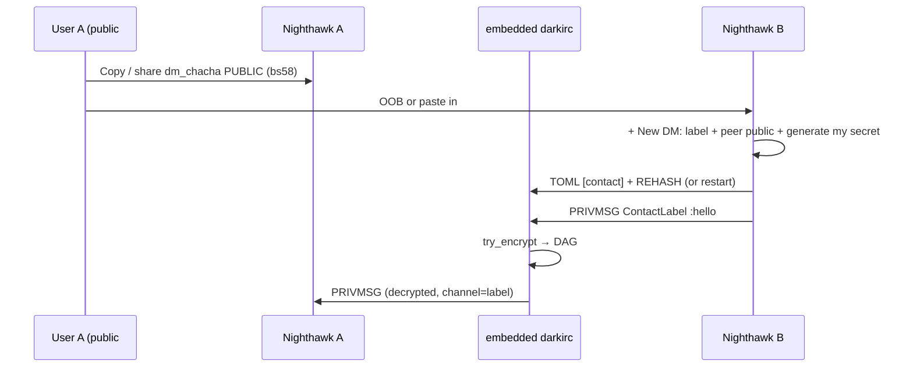

# Direct messaging (DarkIRC E2E) — implementation plan

Plan for **1:1 encrypted DMs** on Nighthawk Android, aligned with the [DarkFi book — private messages](https://codeberg.org/darkrenaissance/darkfi/src/branch/master/doc/src/misc/darkirc/private_message.md) and upstream **`bin/darkirc`** (not desktop **`bin/app`**).

**Related docs:** [`darkfi-chat-upstream.md`](darkfi-chat-upstream.md), [`implementation-plan.md`](implementation-plan.md) (add task **P2-2** when work starts).

---

## 1. Upstream comparison (wallet vs chat)

| Component | Role | DM / E2E support |
|-----------|------|------------------|
| **`bin/darkfid` + wallet (`drk`)** | Balances, scan, send, DAO | None — unrelated to chat keys |
| **`bin/darkirc`** | P2P EventGraph + IRC server | **Full DM:** `[contact."label"]` with `dm_chacha_public` + `my_dm_chacha_secret`; encrypt on send; refuse plaintext DM; **`REHASH`** reloads contacts |
| **`bin/app` `plugin/darkirc.rs`** | In-process EventGraph for desktop UI | **No DM:** `recv` drops any `privmsg.channel` that does not start with `#` (encrypted channels/DMs skipped) |
| **Nighthawk Android** | Embedded `darkirc_exec` + Kotlin IRC to loopback | **Partial:** TOML contacts via `DarkircCryptoStore`; settings UI in `ChatE2eCryptoSettings`; main **Chat** tab is **public `#` channels only** |

**Takeaway:** Implement DMs on the **daemon + IRC** path already used on Android. Do **not** copy `bin/app` chat send/recv — it intentionally ignores non-`#` traffic.

---

## 2. Terminology (avoid “shard” confusion)

| Concept | What it is in this repo |
|---------|-------------------------|
| **DM ChaCha public key** | 32-byte value, **bs58** (from `darkirc --gen-chacha-keypair`). This is what users exchange per the book. |
| **`DarkircContactCryptoConfig.nick`** | Misnamed field — upstream TOML **`[contact."label"]`** **contact label**, **not** IRC nickname. PRIVMSG target must be this label (`/msg Bob`, not `/msg alice_irc`). |
| **`DarkfiChatIdentity.publicIdHex`** | Separate 12-word BIP39 chat fingerprint — **not** the DM ChaCha pubkey. Do not use it as `dm_chacha_public` unless product explicitly merges identities later. |

---

## 3. Book flow → Android mapping



| Book step | Android implementation |
|-----------|------------------------|
| `darkirc --gen-chacha-keypair` | Existing `DarkircCliKeygen.genChachaKeypair` (settings dialog) |
| Add `[contact."…"]` to config | Existing `DarkircCryptoManager.saveContact` → TOML merge |
| `/quote rehash` after edit | **New:** `DarkircIrcClient.sendRehash()` when IRC session is up; fallback `applyAndRestartEmbeddedDaemon` |
| Share public key in `#channel` | **New:** optional “Share my DM key” + parse peer keys from messages |
| `/msg` / `/query` | **New:** `sendToChannel(contactLabel, text)` (already routes non-`#` as DM target) |
| Contact label ≠ IRC nick | **Fix:** decrypt/display/thread keyed by **contact label** (`msg.channel`), not `msg.nick` |

---

## 4. Current gaps and bugs to fix first (P0)

### 4.1 Double encryption / wrong decrypt lookup

- Embedded **`darkirc`** already **`try_encrypt` / `try_decrypt`** on the IRC wire (`client.rs` / `server.rs`).
- Kotlin still runs `DarkfiChatCrypto.encryptMessageIfPossible` / `decryptMessageIfPossible` on send/receive (`DarkfiChatController`).
- **Action:** When `useEmbeddedNode == true`, pass plaintext through IRC only (gate or remove Kotlin ChaCha for that mode). Keep Kotlin path only for a hypothetical external IRC without daemon crypto.

### 4.2 Contact lookup uses wrong field

- `DarkfiChatCrypto` finds contacts by `msg.nick`; upstream DM decrypt sets `privmsg.channel` = **contact label** and `privmsg.nick` = self IRC nick or label.
- **Action:** Lookup encrypt/decrypt (if any remain) by **`contactLabel`** ≡ `DarkircContactCryptoConfig.nick` ≡ `msg.channel` for non-`#` threads.

### 4.3 No `REHASH` on live session

- Settings today always **`applyAndRestartEmbeddedDaemon`** (heavy).
- **Action:** `DarkircIrcClient.sendRaw("REHASH")` or `QUOTE REHASH` after `saveContact`; restart only if REHASH fails or daemon not running.

### 4.4 DM threads invisible in main Chat UI

- `AndroidChat` chip list = `messages.keys + defaultChannels` — only `#…` defaults; no contact labels, no “+” entry point.
- Incoming DMs may be dropped server-side if contact not in TOML (`contacts.contains_key(privmsg.channel)`).

---

## 5. Proposed architecture

### 5.1 Data model (SDK)

| Type / store | Purpose |
|--------------|---------|
| `DarkircContactCryptoConfig` | Unchanged storage; optional rename `nick` → `contactLabel` in API |
| `DmConversationMeta` (new, Room or encrypted prefs later) | `contactLabel`, `peerDisplayHint` (IRC nick if known), `theirPublicKey`, `createdAt`, `lastMessageAt` |
| `messagesByChannel` | Reuse: key = `#dev` or **`contactLabel`** for DM |
| `dmContactLabels: StateFlow<List<String>>` | Derived from crypto store + keys present in `messagesByChannel` |

### 5.2 Pubkey discovery convention

Support manual paste first; optional auto-detect in public chat:

- **Canonical share string:** `!darkfi-dm-pubkey:<bs58>` (single line, easy regex).
- **Parser:** `DarkircDmPubkeyParser.extractBs58PublicKey(text)` — validate decode length == 32.
- **Long-press** on public channel message → if parser finds key → “Start encrypted chat” → pre-fill **New conversation** sheet.

### 5.3 Controller API (`DarkfiChatController`)

```kotlin
// Illustrative — implement in SDK
fun listDmContacts(): List<DarkircContactCryptoConfig>
suspend fun addDmContact(label: String, theirPublicBs58: String, generateSecret: Boolean): Result<Unit>
fun openDmThread(label: String)  // ensures label in UI state
fun shareMyDmPubkeyForNewContact(): String?  // one-shot keypair public for OOB share
```

- `addDmContact`: generate `my_dm_chacha_secret` via CLI, `saveContact`, merge TOML, **`rehashOrRestart()`**, no message required.
- After add, call `sendToChannel(label, "")` optional no-op — book notes WeeChat buffer appears on first **received** msg; Android should **navigate to empty DM thread** immediately (better than WeeChat).

### 5.4 IRC client

- `sendRehash(): Boolean`
- Confirm `sendPrivmsg(contactLabel, body)` matches upstream (no `#` prefix).

---

## 6. UI plan (extends Chat tab)

### 6.1 Chat screen layout (`AndroidChat.kt`)

```
┌─────────────────────────────────────────────┐
│ Chat                          [+]  [⚙]      │  ← + opens New conversation
├─────────────────────────────────────────────┤
│ [Channels] [Direct]                         │  ← segmented control
├─────────────────────────────────────────────┤
│ connection status (5 lines max)             │
├─────────────────────────────────────────────┤
│ Chips: #dev #random …  OR  alice bob …      │
├─────────────────────────────────────────────┤
│ message list                                │
├─────────────────────────────────────────────┤
│ [message field]              [Send]         │
└─────────────────────────────────────────────┘
```

- **+** (top-end): navigate to `chat_new_dm` or modal bottom sheet.
- **⚙**: existing route to `chat_settings` (keep advanced E2E / channel keys there).
- **Direct** tab: LazyRow of contact labels + empty state CTA linking to **+**.

### 6.2 New conversation flow (`NewDmConversationScreen.kt`)

1. **Contact label** (required, unique) — helper text: “Not your IRC nick; used like `/msg Bob`.”
2. **Peer public key** — paste field + “Paste from clipboard” + optional scan from last copied `!darkfi-dm-pubkey:…`
3. **Generate my secret** — default on; uses `DarkircCliKeygen`
4. **Show my public key** — copy button (share back in `#dev` with warning dialog)
5. **Start chat** → `addDmContact` → navigate to `chat_dm/{label}` or select chip on Chat

### 6.3 Public channel affordances

- Long-press message bubble in `#` thread → menu: **Copy text** | **Start DM from pubkey** (if detected).
- Optional overflow: **Share my DM pubkey to this channel** → confirm “Visible to everyone in #dev” → send one line `!darkfi-dm-pubkey:…`.

### 6.4 Settings overlap

- Keep `ChatE2eCryptoSettings` for power users (channel secrets, manual contact edit).
- New flow should call same `DarkircCryptoManager.saveContact` — single source of truth.

---

## 7. Navigation

| Route | Screen |
|-------|--------|
| `BottomNavItem.Chat` | `AndroidChat` (tabs + +) |
| `chat_settings` | existing `AndroidChatSettings` |
| `chat_new_dm` | `NewDmConversationScreen` (optional; can be sheet only) |
| `chat_dm/{contactLabel}` | optional dedicated DM screen, or in-place chip selection |

Prefer **one Chat composable** with mode state first; split routes only if back-stack for “new DM wizard” is needed.

---

## 8. Implementation phases

| Phase | Scope | Status |
|-------|--------|--------|
| **DM-P0** | Fix embedded plaintext path; contact label threading; `REHASH` | **done** — `delegateWireCryptoToEmbeddedDaemon`, `DarkircIrcClient.sendRehash`, `applyContactCryptoChanges` |
| **DM-P1** | Chat UI: Channels/Direct tabs, +, new conversation sheet | **done** — `AndroidChat.kt`, `ChatNewDmSheet.kt` |
| **DM-P2** | Long-press pubkey from `#` channel; share-my-pubkey with warning | **done** |
| **DM-P3** | `DmConversationMeta` persistence, last-message preview, delete contact | **done** — `DmConversationStore` |
| **DM-P4** | Parser unit tests; manual two-device matrix | **done** — `DarkircDmPubkeyParserTest`; device E2E still manual |

---

## 9. Testing matrix

| Test | Type |
|------|------|
| `DarkircDmPubkeyParser` valid/invalid bs58 | unit |
| TOML `[contact."label"]` round-trip | existing `DarkircEmbeddedConfigCryptoTest` |
| REHASH reloads new contact without restart | instrumented + logcat `RPL_REHASHING` |
| A→B DM after pubkey exchange in `#dev` | manual, 2 devices or device + desktop `darkirc` |
| Plaintext DM to unknown label → `ERR_NOSUCHNICK` | manual |

**Prerequisite:** P2P connectivity (Tor/clearnet seeds) — same as public channel history; DM does not bypass network requirements.

---

## 10. Out of scope (this plan)

- Desktop **`bin/app`** DM support (upstream would need plugin changes).
- Channel-wide E2E (`[channel."#…"]` secret) beyond existing settings UI.
- RLN / spam rate limits in contacts.
- Federated “approved keys” server — book trust model is **static local contact list** only.

---

## 11. File touch list (expected)

| Area | Files |
|------|--------|
| SDK | `DarkfiChatController.kt`, `DarkircIrcClient.kt`, `DarkfiChatCrypto.kt`, new `DarkircDmPubkeyParser.kt`, `DarkircCryptoManager.kt` |
| UI | `AndroidChat.kt`, new `NewDmConversation*.kt`, `MainNavigation.kt`, `strings.xml` |
| Docs | this file, `darkfi-chat-upstream.md`, `implementation-plan.md` (P2-2) |

---

## 12. Open product decisions

1. **One global “my DM pubkey”** vs **per-contact secret** — book allows both; current settings generate per-contact secret. Recommend **per-contact secret** (stronger isolation), separate **ephemeral share keypair** only for broadcasting in `#`.
2. **Rename `contact.nick` → `contactLabel`** in Kotlin — clearer for contributors; optional migration alias.
3. **iOS parity** — mirror routes and `DarkircCryptoManager` behavior when Swift chat ships.
